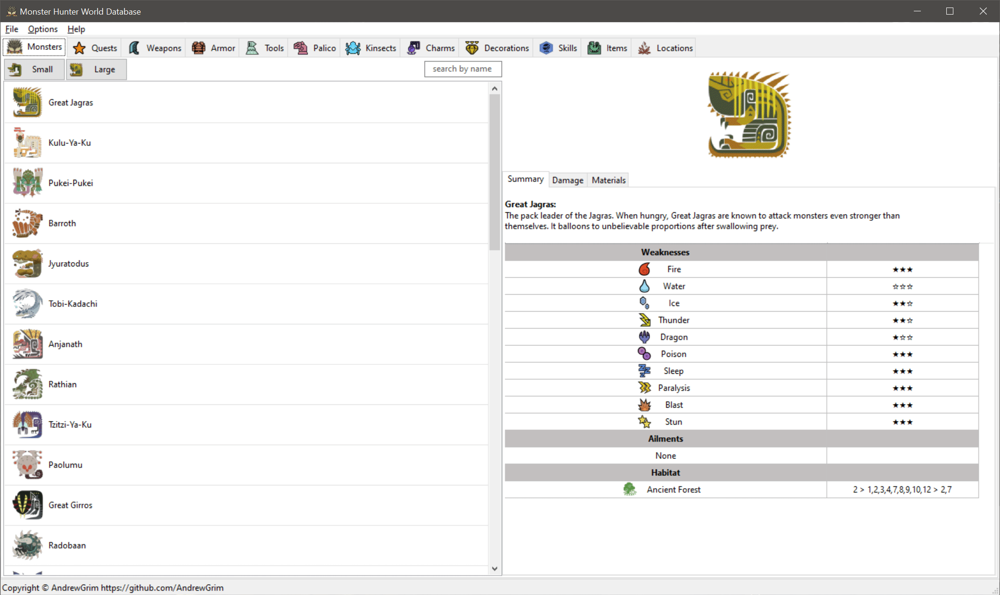

# Monster Hunter World Database

	

This is a database program for Monster Hunter World.

It has been developed and tested on Windows. However since it's using wxPython it should be able to run on Linux and MacOS without too many modifications.

Most of the information is linked. Meaning you can double click on a list item to go to that item's page and load the information about it.

It contains the tabs with the following information:

* Monsters
* Quests
* Weapons
* Armor
* Tools
* Palico
* Kinsects
* Charms
* Decorations
* Skills
* Items
* Locations

	

## Args

The project supports some command line arguments:

`-size` This sets the initial window size in pixels.

    -size <width> <height>
  
`-debug` Enables the the debug/log window on startup. This redirects all stdout, stderr and the wx errors to the debug window.

## Build

You need `Python 3.7` and `pipenv` installed. Then run `pipenv install` in the project directory. Afterwards use `pipenv run python src/Application.py` to run the application.

## Credit

Thanks to https://github.com/gatheringhallstudios for making the projects open source and with a permissive license.
Without their database I probably would never attempt to make this.
